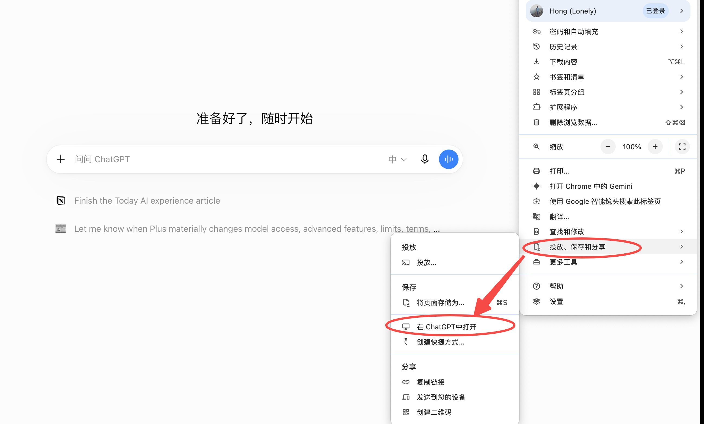

<p align="center">
  
</p>

# aiduGPT⚕爱嘟白月光——网页版 ChatGPT / GPT-5.6 Luna 本地超级 Agent 智控中枢

> **aidu Web-ChatGPT Local-Workspace Orchestrator**
>
> *不只是一次穿透 —— 是一次觉醒。*
>
> *以往，云端的大模型只能在浏览器孤岛里指点江山；*
> *此刻，无需昂贵算力与笨重环境，一根轻巧的官方隧道，便让白月光照进现实。*
> *全盘读写、终端调度、代码重构、多机协同 —— 让网页版免费的 ChatGPT 与 GPT-5.6 Luna 化身拥有实体触手的超级 Agent。*

[](LICENSE)
[](https://www.python.org/)
[](https://nodejs.org/)
[](https://modelcontextprotocol.io/)
[](https://github.com/monkey2jack/aiduGPT/releases)

**中文** | **[📖 English Version](#-english-version)**

---

## 🎯 aiduGPT 是什么？

**aiduGPT（爱嘟白月光）** 是 aidu 家族倾力打造的 **ChatGPT 网页端与本地宿主机深度桥接中枢**。

它利用 OpenAI 官方全新的 **Private MCP Tunnel（私有 MCP 加密隧道）** 协议，搭配优化的本地宿主控制引擎，让用户无需租用公网服务器、无需配置反向代理域名，直接在**官方 ChatGPT 网页版普通对话框**中，调用自己“公鸡（宿主电脑）”上的完整算力与文件资源：

- 🌟 **白月光降临**：直接借用网页版免费额度与最强大的前沿模型（GPT-4o / GPT-5.6 Luna 等顶级大脑），不再受本地小模型与本地显存掣肘；
- ⚡ **无感极速轻量**：静默待机状态 CPU 占用 0%，内存仅数十 MB，无需常驻重型容器或消耗宝贵的电脑性能；
- 🛠️ **40+ 原生全权工具链**：不仅支持任意目录文件的读、写、搜索与精细块编辑，更能直接唤起系统原生终端（Shell / Terminal），执行代码构建、程序启停与网络探测；
- 🛡️ **安全隔离与全盘接管双模可选**：既支持 Docker 纯离线沙盒文件模式，也支持开发玩家热爱的全盘根目录访问。

---

## 🖥️ 多系统兼容性与踩坑避雷指南（必看）

### 🍎 macOS（首选平台，体验最佳）
- **架构支持**：Apple Silicon (M1/M2/M3/M4) 及 Intel 芯片均深度验证通过。
- **踩坑避雷点 1：权限沙盒拦截**  
  默认生成的引擎仅限制在项目 `workspace` 目录下。若要实现“全盘访问（包括桌面、下载、任意项目目录）”，需手动将 `.local/state/engine/config.json` 中的 `allowedDirectories` 改为 `["/"]`，这样 ChatGPT 网页端通过 `host_read_file`、`host_list_directory` 便可自由漫游整个 Mac。
- **踩坑避雷点 2：Docker 依赖是可选的**  
  官方默认安装脚本会检查 `docker`。若电脑未安装 Docker，安装时使用 `--skip-worker` 参数即可跳过容器镜像构建，直接启用原生 Full（完整）主机模式，既省磁盘空间又省内存。

---

### 🪟 Windows（避坑强烈建议使用 WSL2）
- **形态 1：WSL2 模式（强烈推荐 ⭐⭐⭐⭐⭐）**  
  在 Windows 10/11 中安装 WSL2（Ubuntu），并在 WSL2 内部按照 Linux 流程部署 `aiduGPT`。
  - **优势**：完美规避 Windows 命令解析差异。WSL2 原生通过 `/mnt/c/`、`/mnt/d/` 映射 Windows 磁盘，ChatGPT 依然能直接读取和编辑 Windows 宿主机上的所有代码与文件。
- **形态 2：Windows 原生 CMD / PowerShell（不建议折腾 ⚠️）**  
  虽然 OpenAI 官方 `tunnel-client` 提供了 `windows-amd64` 二进制，但项目的执行引擎大多包含 `.sh`、POSIX 路径与终端进程调用。若直接在 Windows 原生环境运行，容易遇到路径反斜杠转义和命令缺失问题，请优先使用 WSL2。

---

### 🐧 Linux（原生支持）
- 支持 Ubuntu / Debian / CentOS / Arch 等主流发行版，环境需预备 `python3`、`uv`、`node`、`npm`、`ripgrep`。

---

## 🚀 极速部署指南（以 macOS 为例）

### 1. 准备依赖
```bash
# 安装必要工具链（以 Homebrew 为例）
brew install python node npm ripgrep
curl -LsSf https://astral.sh/uv/install.sh | sh
```

### 2. 克隆项目与初始化
```bash
git clone https://github.com/monkey2jack/aiduGPT.git
cd aiduGPT

# 以全权模式（Full Mode）安装，并跳过 Docker 构建
python3 scripts/install.py \
  --workspace ~/aiduGPT/workspace \
  --state ~/aiduGPT/.local/state \
  --mode full \
  --skip-worker \
  --no-register
```

### 3. 解锁全盘访问权限（可选但推荐）
编辑 `~/.local/state/engine/config.json`，将 `allowedDirectories` 改为根目录：
```json
{
  "telemetryEnabled": false,
  "allowedDirectories": [
    "/"
  ]
}
```

### 4. 安装官方隧道客户端（tunnel-client）
```bash
mkdir -p ~/.local/bin
curl -fsSL https://github.com/openai/tunnel-client/releases/download/v0.0.14/tunnel-client-runtime-v0.0.14-darwin-arm64.zip -o /tmp/tunnel-client.zip
unzip -q -o /tmp/tunnel-client.zip -d /tmp/tunnel-client-extracted
cp /tmp/tunnel-client-extracted/tunnel-client ~/.local/bin/
chmod +x ~/.local/bin/tunnel-client
rm -rf /tmp/tunnel-client.zip /tmp/tunnel-client-extracted
```

### 5. 申请 OpenAI 隧道与启动
1. 访问 [OpenAI Platform Tunnels](https://platform.openai.com/settings/organization/tunnels) 创建隧道，绑定工作区，获得 `tunnel_id`。
2. 访问 [OpenAI API Keys](https://platform.openai.com/api-keys) 生成 Restricted Key，权限只选 **Tunnels Read + Use**。
3. 写入 Key 并启动守护进程：
```bash
echo "你的_sk_key" > ~/aiduGPT/.local/state/runtime-key
chmod 600 ~/aiduGPT/.local/state/runtime-key

~/.local/bin/tunnel-client run \
  --control-plane.tunnel-id "你的tunnel_id" \
  --control-plane.api-key "file:/Users/你的用户名/aiduGPT/.local/state/runtime-key" \
  --mcp.command "command=/Users/你的用户名/aiduGPT/.local/state/launch.sh" \
  --health.listen-addr "127.0.0.1:0" \
  --health.url-file "/Users/你的用户名/aiduGPT/.local/state/tunnel-health.url" &
```

### 6. 在 ChatGPT 网页端连接
1. 打开 [ChatGPT 网页端](https://chatgpt.com/) -> 设置 -> 安全与登录 -> 开启 **开发者模式**。
2. 进入 **连接的应用（Connected Apps）** -> 点击添加应用：
   - 方式：选择 **隧道 (Tunnel)**
   - 隧道 ID：填入你创建的 `tunnel_...`
   - 身份验证：选择 **无身份验证 (No Auth)**
3. 开启新对话，即可直接指派大模型操作你的电脑！

---

## 💡 终极丝滑体验：将网页版一键封装为桌面 App（PWA）

为了让「爱嘟白月光」像原生桌面客户端一样随叫随到，无需每次在浏览器标签页翻找，强烈建议将其安装为独立桌面应用：

<p align="center">
  
</p>

1. 使用 Google Chrome 打开 [ChatGPT 官网 (chatgpt.com)](https://chatgpt.com/)。
2. 点击右上角菜单图标 `⋮`（三个小点）。
3. 展开 **「投放、保存和分享」**（Cast, save, and share）。
4. 选择 **「将网页作为应用安装...」**（Install page as app...）。
5. 确认安装后，你的 Mac Dock 栏或 Windows 任务栏就会直接出现 ChatGPT 图标，独立窗口、无地址栏纯净沉浸，秒级呼出本地全权 Agent！

---

<br><br>

---

<a name="-english-version"></a>
# aiduGPT⚕Aidu White Moonlight - Web-ChatGPT Local Super Agent Hub

> **aidu Web-ChatGPT Local-Workspace Orchestrator**
>
> *Not just a tunnel — an awakening.*
>
> *Cloud LLMs used to be trapped in browser sandboxes;*  
> *Now, via OpenAI's official private MCP tunnel, bring your favorite frontier model directly into your local machine.*  
> *Read, write, compile, run terminal commands, and orchestrate projects locally using ChatGPT for web.*

[](LICENSE)
[](https://github.com/monkey2jack/aiduGPT/releases)

---

## 🎯 Key Highlights

- **Zero API Inference Cost**: Harness the intelligence of web-tier frontier models without paying per-token API fees or needing heavy local GPUs.
- **Ultra Lightweight**: Idle CPU overhead is virtually 0%, with mere tens of megabytes in memory consumption.
- **40+ Native Tools**: Full filesystem manipulation, block-level code editing, search, process spawning, and terminal execution.
- **Cross-Platform Compatibility**: Native optimization for macOS Apple Silicon and Intel; recommended WSL2 deployment for Windows users.

---

## 💡 Pro Tip: Install Web ChatGPT as a Native Desktop App (PWA)

To make your "White Moonlight" agent seamlessly accessible without keeping browser tabs cluttered, install it as a standalone desktop application via Chrome:

<p align="center">
  
</p>

1. Open [chatgpt.com](https://chatgpt.com/) in Google Chrome.
2. Click the top-right `⋮` menu.
3. Select **Cast, save, and share** -> **Install page as app...**.
4. Launch directly from your macOS Dock or Windows Taskbar with zero browser UI distractions!

---

## 📄 License
This project is open-source under the [MIT License](LICENSE).
Partially incorporates architecture adapted from Desktop Commander and local-workspace-mcp with respect to upstream licenses.

---

<p align="center">
  <b>🎪 欢迎莅临 aidu 家族乐园</b><br>
  <a href="https://aidupark.com" target="_blank"><b>aiduPARK⚕爱嘟乐园 · aidupark.com</b></a><br>
  <sub>专注 HERMES AGENT 的中文社区 · 爱马士们的实用百宝箱</sub>
</p>

